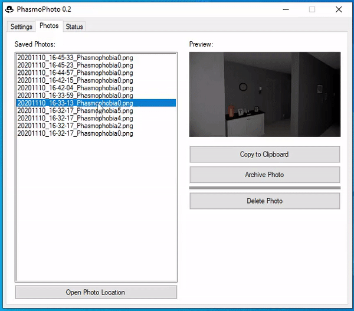

# PhasmoPhoto
An application to save and manage your in-game Phasmophobia photos.

# Settings Tab

On the first run, PhasmoPhoto will look for the Phasmophobia default install location. If its not there you will have to specify it yourself in Settings. 

You will then need to specify the directory where you wish to save your Phasmophobia still photos.

Here is a description of the other settings:
- Interval
  - The number of seconds between each check for new photos.
- Maximum Number of Photos to Save
  - The maximum number of photos to save in the "Photo Save Directory".
  - Archived photos do not count toward this number.
  - This check happens periodically, so there may be a brief period where there are more than the max photos.
- Minimize to Tray on Close
  - If this is checked, when the X is clicked PhasmoPhoto will minimize to the System Tray. There is an icon in the Tray to restore the GUI or exit.

Be sure to click "Save Settings" when you have everything configured. Settings are saved to a config file in the AppData directory.

`C:\Users\<User>\AppData\Local\PhasmoPhoto\phasmophoto.config`

This config file also contains file hashes. These hashes allow PhasmoPhoto to know which photos have already been saved.

# Photos Tab

The Photos tab is where you can manage the photos you take in game. There is a list of all the photos saved, sorted descending. Select a photo to view its thumbnail, as well as perform a few actions:
- Copy to Clipboard
  - This button will copy the photo file contents to the clipboard to be pasted elsewhere.
- Archive Photo
  - This button will make an additional copy of the photo to a subdirectory called "Archived".
  - These photos will remain there until they are manually removed and are not subject to the max photo limit.
- Delete Photo
  - This button will delete the currently selected photo.
- Open Photo Location
  - This button will open an explorer window of the Photo Save Directory.

# Status Tab

This tab displays relevant information about PhasmoPhoto, such as when:
- New photos are found and copied
- Photos are deleted manually or by the Max Photo Limit.
- Error messages if something goes wrong.
- Various status messages.
- If Phasmophobia is currently running 
  - PhasmoPhoto will not check for new photos unless the game is running.

# Other Info

This application is an AutoIt script compiled to EXE. Your Anti-Virus may complain about PhasmoPhoto. This is due to AutoIt being a common development platform for malicious files and the fact that PhasmoPhoto is a very new (uncommon) application. If you are uncomfortable running the exe, you can always install AutoIt and run phasmophoto.au3 manually.

I will provide a SHA1 checksum for each release to verify the file hasn't been tampered with.

If there are any questions or comments, raise an issue via GitHub or send an email to `chill@chillaspect.com`.
